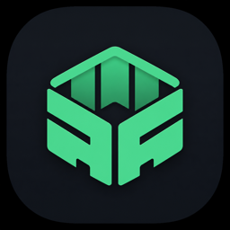

<div align="center">
  

  # DevDock

  **All your local dev stacks. One workspace.**

  Scan your machine for projects, start and stop them without touching Terminal,
  target simulators and emulators, and group related stacks into one-click workspaces —
  all from a native macOS menu bar app.

  Free and open source. No account, no license key.

  [](LICENSE)
  

  [Install](#install) · [Features](#features) · [Build from source](#build-from-source) · [Contributing](#contributing)
</div>

---

## Why DevDock

Most days end up with a handful of terminal tabs open just to keep a Next.js app, an API,
and a Flutter emulator running side by side. DevDock replaces that with one window:
it finds the projects on your disk, knows how to start each one, and remembers the
combinations you run together.

## Features

### Scan & detect

DevDock walks your project folders and identifies what it finds — no config needed.

- 36 frameworks detected out of the box: Next, Nuxt, Remix, Astro, Gatsby, Angular,
  Svelte/SvelteKit, Solid, Ember, Vite, Vue, React, Quasar, Expo, React Native, Flutter,
  Ionic, Nest, Express, Fastify, Hono, Koa, Laravel, Symfony, Django, Flask, FastAPI,
  Rails, Spring Boot, .NET, Phoenix, Go, Rust, Electron, Tauri
- Monorepo-aware naming (`studio/web`, `studio/api`)
- Stack roles (Web / Mobile / API / Desktop) that power workspace suggestions
- Re-scans on launch so newly supported stacks stay visible

### Start, stop, restart

- One click to run a project's dev command with a GUI-friendly `PATH`
- Stop kills the *entire* process tree and verifies it actually exited — no orphaned
  dev servers left behind
- Detects when a port is already serving that same project from a Terminal session
  (shown as external, not re-launched)
- Per-framework stack commands (install, migrate, test, build, artisan, …) plus your
  own custom one-shot commands
- Live CPU / RAM for the managed process tree

### Mobile — Expo, React Native, Ionic, Flutter

- Connected devices list: booted simulators, `adb` devices, physical devices when visible
- One-click targets for iOS Simulator, Android Emulator, and Web — these never
  silently fall back to a physical phone
- Simulators and emulators are booted and polled until actually ready before the app
  is launched onto them
- Flutter is FVM-aware; hot reload / restart / inspector keys work in place
- Metro keys (`r`, `m`, `j`, …) for Expo / React Native / Ionic

### Logs

- Off-canvas log drawer (not a modal) with All / Errors / Warnings tabs and live counts
- Copy the current tab to clipboard, auto-scrolling, selectable text

### Workspaces & menu bar

- Group projects into a workspace and launch them together, staggered if you like
- Auto-suggested workspaces based on stack roles
- Favorites, recents, and sidebar filters
- Full control from the menu bar — start, stop, and run your morning routine without
  opening the main window

## Install

```bash
brew tap bkrdmrcioglu/devdock https://github.com/bkrdmrcioglu/devdock
brew install --cask devdock
```

Or download the zip from [Releases](https://github.com/bkrdmrcioglu/devdock/releases).

**Requirements:** macOS 14+

## Build from source

```bash
brew install xcodegen   # if you don't have it
git clone https://github.com/bkrdmrcioglu/devdock.git
cd devdock
xcodegen generate
open DevDock.xcodeproj
```

Or build headless:

```bash
xcodegen generate
xcodebuild -scheme DevDock -configuration Debug -derivedDataPath .derivedData build
open .derivedData/Build/Products/Debug/DevDock.app
```

Package a `.app` + zip the same way releases are cut:

```bash
./scripts/release.sh
```

App sandbox is off so DevDock can spawn processes and scan folders — keep that in mind
if you fork this for your own signing/notarization setup.

## Stack detection fixtures

Minimal fixtures exist for every supported framework, used to verify detection doesn't
regress:

```bash
./scripts/generate-stack-fixtures.sh
./scripts/verify-stack-fixtures.swift
```

See [Fixtures/README.md](Fixtures/README.md). Add `Fixtures/stacks` as a scan root in
DevDock to browse them in the UI.

## Contributing

Issues and pull requests are welcome — bug reports, new framework detection, or
feature ideas. Nothing is gated behind a paid tier, so feel free to dig in.

## Support

DevDock is free with no catch. If it saves you time, consider
[buying a coffee](https://buymeacoffee.com/bkrdmrcioglu) — entirely optional.

## License

[MIT](LICENSE)
